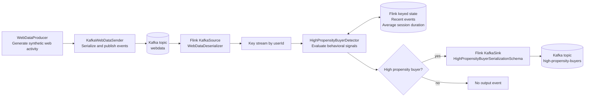

# High Propensity Buyer Detection System

A real-time stream processing application that identifies high-propensity buyers based on web activity data using Apache Flink and Kafka.

## Architecture Overview

This project implements a streaming data pipeline that processes web activity data to identify potential high-value customers. The system consists of three main layers:

1. **Data Production Layer**: Generates and sends web activity data to Kafka
2. **Stream Processing Layer**: Processes the data using Apache Flink
3. **Output Layer**: Produces high propensity buyer events

### Stream Flow



### Component Details

#### Producer Components
- `WebDataProducer`: Generates synthetic web activity data
- `KafkaWebDataSender`: Handles the communication with Kafka
- `WebDataSerializer`: Serializes web data events for Kafka

#### Processing Components
- `DataStreamJob`: Main Flink job that orchestrates the processing pipeline
- `WebDataDeserializer`: Deserializes incoming Kafka messages
- `HighPropensityBuyerDetector`: Core logic for identifying high-value customers
- `HighPropensityBuyerSerializationSchema`: Serializes output events

#### Data Models
- `WebData`: Represents web activity events (page views, cart activities)
- `HighPropensityBuyer`: Represents identified high-value customers

## Getting Started

### Prerequisites
- Java 17 or higher
- Apache Maven
- Docker and Docker Compose

### Installation

1. Clone the repository:
```bash
git clone [repository-url]
```

2. Install Maven if needed:
```bash
brew install maven
```

3. Build the project (run from the project root, where `pom.xml` lives):
```bash
mvn clean package
```

4. Start the environment:
```bash
docker compose up -d
```

## Demo

### Run with the Flink Dashboard

The Docker Compose environment includes Kafka, Kafka UI, the Kafka REST Proxy, and a Flink cluster.

Open these dashboards after starting the environment:

- Kafka UI: [http://localhost:18080](http://localhost:18080)
- Flink Dashboard: [http://localhost:18081](http://localhost:18081)

Submit the stream processor to Flink (run from the project root):

```bash
docker compose cp target/webdata-stream-processor-1.0-SNAPSHOT.jar jobmanager:/opt/flink/app.jar

docker compose exec jobmanager flink run /opt/flink/app.jar \
  --kafka.bootstrap.servers kafka:9092 \
  --kafka.topic.input webdata \
  --kafka.topic.output high-propensity-buyers
```

Generate demo web activity events continuously from your local machine (run from the project root):

```bash
java -cp target/webdata-stream-processor-1.0-SNAPSHOT.jar \
  org.digitalpower.producer.KafkaWebDataSender \
  --kafka.bootstrap.servers localhost:29092 \
  --kafka.topic webdata \
  --number-of-users 5 \
  --continuous \
  --interval-ms 1000
```

Use `Ctrl+C` to stop the producer. To emit a fixed number of events instead, replace `--continuous --interval-ms 1000` with `--number-of-events 100`.

Inspect messages in Kafka UI:

- Open the `webdata` topic to see incoming generated events.
- Open the `high-propensity-buyers` topic to see users emitted by the Flink detector.

You can also watch the output topic from the terminal:

```bash
docker compose exec kafka kafka-console-consumer \
  --bootstrap-server kafka:9092 \
  --topic high-propensity-buyers \
  --from-beginning
```

Use `kafka:9092` for commands running inside Docker containers, such as the Flink job. Use `localhost:29092` for commands running directly on your machine, such as the demo event producer. Start the stream processor with `flink run` in the JobManager container because the Flink runtime provides dependencies that are not bundled for direct `java -cp` execution.

## Testing

Run the test suite:
```bash
mvn test
```

## Configuration

Key configuration files:
- `docker-compose.yml`: Contains service configurations for Kafka, Zookeeper, Kafka UI, Kafka REST Proxy, and Flink
- `src/main/resources/log4j2.properties`: Logging configuration

## Project Structure

```
├── src/
│   ├── main/java/org/digitalpower/
│   │   ├── deserialize/      # Kafka/Flink deserialization
│   │   ├── models/           # Data models
│   │   ├── process/          # Flink processing logic
│   │   ├── producer/         # Kafka producer components
│   │   └── serialize/        # Serialization logic
│   └── test/                # Test classes
├── docker-compose.yml       # Docker services configuration
└── pom.xml                 # Maven configuration
```
